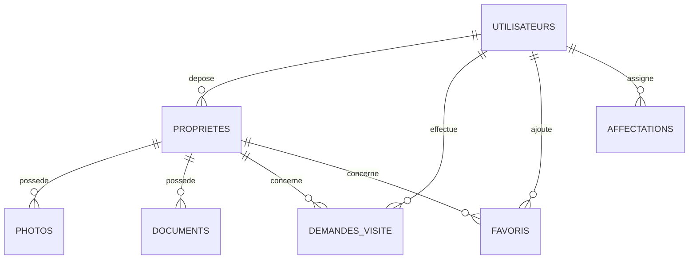

<div align="center">

#  Habitat-Horizon

### Plateforme de Gestion Immobilière

</div>

---

##  Sommaire

- [À propos](#-à-propos)
- [Fonctionnalités](#-fonctionnalités)
- [Architecture des rôles](#-architecture-des-rôles)
- [Structure de la base de données](#-structure-de-la-base-de-données)
- [Prérequis](#-prérequis)
- [Installation](#-installation)
- [Structure du projet](#-structure-du-projet)
- [Comptes de démonstration](#-comptes-de-démonstration)
- [Sécurité](#-sécurité)
- [Technologies utilisées](#-technologies-utilisées)
- [Contribuer](#-contribuer)
- [Licence](#-licence)

---

##  À propos

**Habitat-Horizon** est une application web de gestion immobilière développée en PHP natif (sans framework) connectée à une base de données MySQL. Elle met en relation **bailleurs**, **clients**, **agents immobiliers** et **managers** autour de la publication, la validation, la consultation et la visite de biens (villas, appartements, terrains, commerces, bâtiments).

Le projet a été conçu pour le marché immobilier burkinabè (Ouagadougou) avec un thème visuel **Noir & Or** professionnel.

---

##  Fonctionnalités

###  Espace Client
- Recherche et filtrage des propriétés (type, zone, vente/location)
- Consultation détaillée d'un bien (galerie photo, description, prix)
- Ajout / suppression de favoris 
- Demande de visite auprès de l'agent affecté
- Suivi du statut des visites (en attente / validée / refusée)
- Messagerie directe avec son agent (service client)

###  Espace Agent
- Gestion des clients affectés
- Traitement des demandes de visite (validation / refus avec motif)
- Messagerie avec les clients

###  Espace Bailleur
- Dépôt d'annonces immobilières (avec photos et documents justificatifs)
- Suivi du statut de publication des biens

###  Espace Manager
- Validation/refus des annonces déposées par les bailleurs
- Affectation des agents aux clients
- Vue d'ensemble de la plateforme

### Authentification
- Inscription (client / bailleur)
- Connexion sécurisée avec hashage des mots de passe (`password_hash`)
- Récupération de mot de passe (vérification email + téléphone)
- Gestion de session sécurisée (régénération d'ID, cookies `httponly`)

---

##  Architecture des rôles

| Rôle       | Fichier principal       | Accès                                              |
|------------|--------------------------|-----------------------------------------------------|
| Client     | `client.php`             | Recherche, favoris, demandes de visite, messagerie |
| Bailleur   | `bailleur.php`           | Dépôt et suivi des annonces                        |
| Agent      | `agent.php`               | Gestion des clients affectés et des visites        |
| Manager    | `manager.php`             | Validation des annonces, affectation des agents    |

La redirection après connexion (`connexion.php`) se fait automatiquement selon le champ `role` de l'utilisateur.

---

##  Structure de la base de données

Base de données : **`gestion_immobiliere`** (voir [`gestion_immobiliere.sql`](./gestion_immobiliere.sql))

| Table              | Description                                         |
|---------------------|------------------------------------------------------|
| `utilisateurs`       | Comptes (client, bailleur, agent, manager)          |
| `proprietes`         | Biens immobiliers déposés par les bailleurs         |
| `photos`             | Photos liées à chaque propriété                     |
| `documents`          | Justificatifs (titre foncier, attestations…)        |
| `demandes_visite`    | Demandes de visite client → agent                    |
| `favoris`            | Biens favoris des clients                            |
| `affectations`       | Liaison client ↔ agent                               |
| `messages`           | Messagerie interne (client ↔ agent)                  |
| `notifications`      | Notifications à destination du manager               |



---

##  Prérequis

- **PHP**  (avec extension `pdo_mysql`)
- **MySQL** / **MariaDB** ≥ 
- Serveur **WAMP** / **XAMPP** / **LAMP** (ou tout serveur Apache + PHP)
- Navigateur web moderne

---

## Installation

1. **Cloner le dépôt**
   ```bash
   git clone https://github.com/zebabenidriss-cyber/projet-d-integration.git
   cd gestion_immobiliere
   ```

2. **Placer le projet dans votre serveur local**
   - Exemple avec WAMP : copier le dossier dans `C:\wamp64\www\habitat-horizon`

3. **Créer la base de données**
   - Ouvrir phpMyAdmin (ou la CLI MySQL)
   - Créer une base nommée `gestion_immobiliere`
   - Importer le fichier [`gestion_immobiliere.sql`](./gestion_immobiliere.sql)


4. **Configurer la connexion à la base** dans [`init.php`](./init.php) :
   ```php
   define('DB_HOST', 'localhost');
   define('DB_NAME', 'gestion_immobiliere');
   define('DB_USER', 'root');
   define('DB_PASS', '');
   ```

5. **Lancer le serveur**
   - Démarrer Apache + MySQL (WAMP/XAMPP)
   - Accéder à l'application via :
     ```
     http://localhost/gestion_immobiliere/index.php
     ```

---

##  Structure du projet

```
gestion_immobiliere/
├── index.php                  # Page d'accueil publique (catalogue de biens)
├── connexion.php              # Page de connexion
├── inscription.php             # Page d'inscription (client/bailleur)
├── mot_de_passe_oublie.php    # Récupération de mot de passe
├── init.php                    # Connexion DB + session + fonctions utilitaires
├── header.php / footer.php    # Composants communs
├── propriete_detail.php       # Détail d'une propriété
├── Demande.php                 # Formulaire de demande de visite
├── Favoris.php                  # Gestion des favoris client
├── mes_visites.php              # Historique des visites client
├── service_client.php          # Messagerie client ↔ agent
├── messagerie_agent.php        # Messagerie agent ↔ clients
├── client.php                   # Tableau de bord client
├── bailleur.php                 # Tableau de bord bailleur
├── agent.php                    # Tableau de bord agent
├── manager.php                  # Tableau de bord manager
├── script.JS                    # Scripts JS (confirmations, aperçu photo, lightbox…)
└── gestion_immobiliere.sql     # Export complet de la base de données
```

---

##  Comptes de démonstration

>  Mots de passe fournis à titre d'exemple — **à modifier en production**.

| Rôle      | Email                  |
|-----------|--------------------------|
| Manager   | `manager@gmail.com`     |
| Agent     | `dao@gmail.com`          |
| Agent     | `paco@gmail.com`         |
| Bailleur  | `razack@gmail.com`       |
| Bailleur  | `archad@gmail.com`       |
| Client    | `ben@gmail.com`          |
| Client    | `pierre@gmail.com`       |

---

##  Sécurité

- Mots de passe hashés avec `password_hash()` / vérifiés via `password_verify()`
- Requêtes SQL préparées (PDO) pour prévenir les injections SQL
- Régénération de l'identifiant de session après connexion (`session_regenerate_id`)
- Cookies de session en `httponly` + `SameSite=Lax`
- Échappement systématique des sorties HTML via `htmlspecialchars()`
- Contrôle d'accès par rôle sur chaque page sensible

---

##  Technologies utilisées

- **PHP -** (procédural, sans framework)
- **PDO** pour l'accès à la base de données
- **MySQL / MariaDB**
- **HTML5 / CSS3** (design responsive, thème Noir & Or)
- **JavaScript** 

